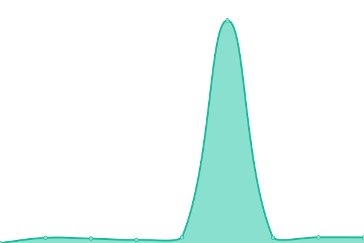
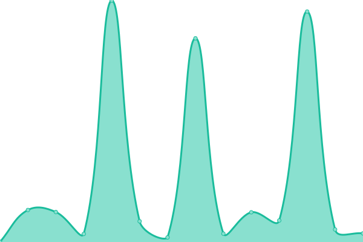

# [📈 Live Status](https://status.vistacloud.org): <!--live status--> **🟧 Partial outage**

This repository contains the open-source uptime monitor and status page for [stxrlite](twitch.tv/stxrlite_), powered by [Upptime](https://github.com/upptime/upptime).

With [Upptime](https://upptime.js.org), you can get your own unlimited and free uptime monitor and status page, powered entirely by a GitHub repository. We use [Issues](https://github.com/stxrlite/vistaclouduptime/issues) as incident reports, [Actions](https://github.com/stxrlite/vistaclouduptime/actions) as uptime monitors, and [Pages](https://status.vistacloud.org) for the status page.

<!--start: status pages-->
<!-- This summary is generated by Upptime (https://github.com/upptime/upptime) -->
<!-- Do not edit this manually, your changes will be overwritten -->
<!-- prettier-ignore -->
| URL | Status | History | Response Time | Uptime |
| --- | ------ | ------- | ------------- | ------ |
|  [Website Hosting](https://web.vistacloud.org:2222) | 🟩 Up | [website-hosting.yml](https://github.com/stxrlite/vistaclouduptime/commits/HEAD/history/website-hosting.yml) | 

 329ms
     
 | 

<a href="https://status.vistacloud.org/history/website-hosting">100.00%</a>
    

|  [Billing Portal](https://portal.vistacloud.org) | 🟩 Up | [billing-portal.yml](https://github.com/stxrlite/vistaclouduptime/commits/HEAD/history/billing-portal.yml) | 

 1856ms
     
 | 

<a href="https://status.vistacloud.org/history/billing-portal">100.00%</a>
    

|  [Panel](https://panel.vistacloud.org) | 🟥 Down | [panel.yml](https://github.com/stxrlite/vistaclouduptime/commits/HEAD/history/panel.yml) | 

 642ms
     
 | 

<a href="https://status.vistacloud.org/history/panel">84.61%</a>
    

|  [Node 01 PA](23.159.176.2) | 🟥 Down | [node-01-pa.yml](https://github.com/stxrlite/vistaclouduptime/commits/HEAD/history/node-01-pa.yml) | 

 36ms
     
 | 

<a href="https://status.vistacloud.org/history/node-01-pa">100.00%</a>
    

<!--end: status pages-->

[**Visit our status website →**](https://status.vistacloud.org)

## 📄 License

- Powered by: [Upptime](https://github.com/upptime/upptime)
- Code: [MIT](./LICENSE) © [stxrlite](twitch.tv/stxrlite_)
- Data in the `./history` directory: [Open Database License](https://opendatacommons.org/licenses/odbl/1-0/)
